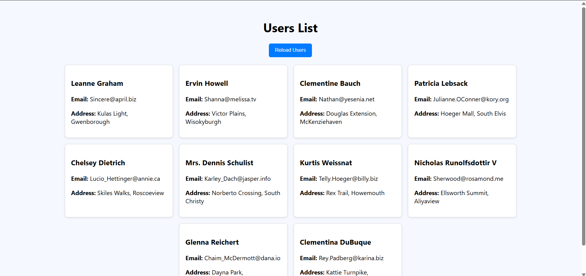

# task-7
This project demonstrates how to fetch user data from a public API using JavaScript's Fetch API and display it dynamically on a webpage.

## Objective

- Use JavaScript Fetch API to get user data from a public API.
- Display the data on the page with proper styling and interactivity.

## Features added

- Fetches user data asynchronously from a public API.
- Displays user's name, email, and address in styled cards.
- Shows a loading spinner while fetching data.
- Includes a search input to filter users by name.
- Reload button to re-fetch data anytime.
- Graceful error handling with user-friendly messages.

## API Used

Data is fetched from:
> [https://jsonplaceholder.typicode.com/users](https://jsonplaceholder.typicode.com/users)

## Tools Used

- HTML5, CSS3
- JavaScript (Fetch API)
- Code Editor: VS Code
- Browser: Google Chrome

## Files Included

- `index.html`: HTML structure and layout.
- `styles.css`: Styling for the page and user cards.
- `script.js`: JavaScript to fetch and display user data.
- `README.md`: Project documentation.

## Screenshot

